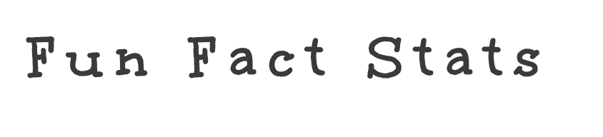
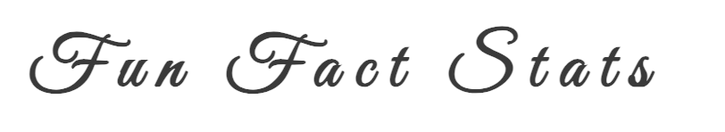
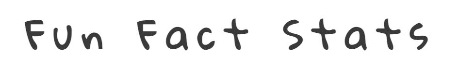
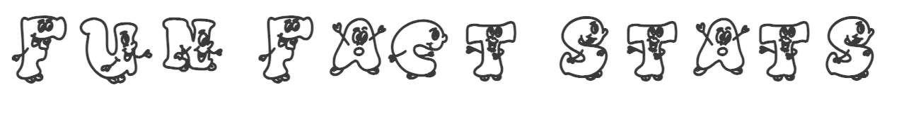

<red> Information sources to the organised and presented in the final version </red>

<gr> Notes to myself - to be deleted in final submission</gr>

# Fun Facts Stats

Fun Fact Stats is a webpage dedicated to break the anxiety around  the learning and application of statistical methods.
Students tend to struggle with statistical concepts. They have pre-set opinions about Statistics, which make them anxious even before starting to learn. Also, in most cases, they perceive statistics to have abstract concepts; it is very hard for them to relate and to see the point of all calculations. 

This website aims to show the learners and users of statistical methods the fun side of statistics. It does so by two means: 

1. providing fun facts about statistics and 
2. designing online games starting from the very basic and advancing further as understanding improves.

The inspiration for this page came from the book "Lady Testing Tea" by David Salsburg. Hence, the first fun fact on the site is Lady Testing Tea. The aim is to add new stories, new fun facts regularly to keep the users of the website engaged. 

The target audience for this website are UG students, although anybody who is interested with statistics is welcomed!

<gr> Add a screenshot of responsiveness</gr>

## Features 

<gr> In this section, you should go over the different parts of your project, and describe each in a sentence or so. You will need to explain what value each of the features provides for the user, focusing on who this website is for, what it is that they want to achieve and how your project is the best way to help them achieve these things. </gr>

### Existing Features

#### Favicon

- The normal distribution is chosen as the favicon for this website due to its simplicity, allowing for an easy recognition even when it is tiny. 

- The area under the normal diustribution curve is shaded in red to introduce a greater contrast with the white background and also it is the same color as the "anxious" statistics monster.

#### Navigation Bar

- The navigation bar includes links to five main pages: Home, Fun Facts, Fun Stats, Subscribe, Feeling overwhelmed? 

- The background color of the navigation bar is chosen to be a warm color, gold, to create a positive feeling for the user.

- Similarly, the header fonts (Rock-Salt and Happy Monkey) are  chosen because of their fun-looking style, to match the title. 

- The navigation links open on the same page, except "Feeling overwhelmed?", which opens on a new page. This is because the latter is designed to be an impactful motivational poster, free of any header or footer items. 

#### Fonts

The following fonts are used:  

- "Lexend" for the body and footer text. "Lexend" is chosen for the main text because a small scale study has shown that people can read and understand more easily when this font style is used. I have been using this font in documents that I produce for my students (in my professional role). 

- "Happy Monkey" for headings level 2 and higher. I found this font after a search on keywords "smile", "fun", and "happy" on Google Fonts. Since the page is aiming to the "fun", a font style that would give that effect was preferred. Like "Lexend", "Happy Monkey" is also easy to read, and it is  "fun". It also matches the font style I use for the header ("Rock Salt") 

- "Rock Salt" for heading level 1 (which is the main header of the wage). Choosing the font style for header was the most difficult. Since it serves as the logo to the page, it takes an important role. <gr> I wanted .... it to read easily...  </gr>

A few alternative options were consired for the header. 

#### Fonts for the Header

<gr> I have tried alternative logos and fonts for the header. Because the page targets students and aims to help them get familiar with Statistics *help them like statistics), I wanted the header to be fun. (Check  the notes you wrote on notebook) </gr>

Below, I provide screenshots of some alternatives considered. 

- Google Fonts 

<gr>
- The webpage that I used
The webpage did in fact produce something very close to what I wanted. Also, I managed to align the fonts so that they resemble (to follow) a normal distribution. But I dis not use this in the end, because the text was created as a link to an image, which was not as practical as working with fonts and text.  
</gr>

#### Landing page

- Landing page includes images of two cute fluffy monsters. 
  - The grumpy-looking red monster (anxious monster) represents the anxiety around statistics and how people perceive it to be scary. Although it is perceived to be scary, it actually is not. 
  - The fluffy blue monster with a smiling face (happy monster) is the real identity of statistics: fun, playful, and <gr> xxx/>

- I wanted the user to see the "real" face of the statistics monster by somehow changing the look of the anxious monster to a happy monster. With the limitations of the html and css, I did this using hoover style. In large screens, hoovering over the anxious monster reveals the real face of it: the happy monster.   

- Inspired by the Code Institute's love-running walk through example, these images are included as background images. Because each of these images also represent a meaning, an alt text for each was added through using hidden images in the div they are located. 

- Through the happy monster, statistics is depected as fun, engaging, playful, and also helping the user to get stronger (i.e. more employable). Each of these characteristics are linked to a page:
  - _fun_ links to "fun facts" page
  - _engaging_ links to "subscribe" page (note: this is not a perfect match, and will need to be revisited in the future)
  - _playful_ links to "fun stats" page
  - makes you _stronger_ links to "motivational" page.

- The color of text linked to these pages changes to pink when user hovers on large screens 

#### Fun facts page

- This page aims to show learners of statistics some interesting facts about statistics by revealing where (or under which circumstances) the most commonly used statistical concepts originate from. 

- At the moment, there is a single story under this page. The intention is  to develop it further, adding more interesting facts over time. 

- The next story will be on the t-distribution and how statisticians of the Guinness beer factory came with the idea. 

 
#### Fun stats page

- There is a placeholder for this page on the website but the currently the only content is an under-construction-type image. 

- To encourage users to come back to the page, brief information is provided with text "stats game under construction" rather than a general message (which may become very discouraging). 

- It will be an interactive page which aids students in their learning by starting from the basic calculations and moving on to more complicated ones as students progress. 

- It will achive the above objective by creation of a simple interactive statistics game.

#### Motivational poster page

- This is a poster that I created while learning CSS formatting and the Box Model.  

- It is a page on its own right. Therefore it is the only link on the navigation panel that opens on a new page. It does not have a link back to the homepage either. It is self-standing.  

- It shows quite a contrast to other pages on the site, but it is designed to impress and take the whole attention to the message. 

- It is a reminder for everybody: learners of all subjects, people working towards their targets, and myself. 

- I used two alternative, but similar images for this page. An image in portrait view loads for mobile phone users while another image with a landscape view loads for tablets and gadgets with larger screens.  

## Problems faced

- (8 September 2024) I created my project repository on 7 September 2024. I worked on the `index.html`, `style.css` and  did a few commits locally, but when I attempted to push all these changes to GitHub, I realized that there was an issue with the file locations. I kept receiving error messages and failed to push my changes to GitHub. To my understanding, this happened because when I was cloning the GitHub repository initially, I did it wrong. I initially created a folder in the same name as the repository and then attempted a clone, which created a directory within the directory, both with the same name. Seeing this, I moved files around so that I do not have folder within a folder locally, but all files are located under the main folder. I think this  change in file structures created the issue. To ensure that I do not  have similar issues, I created a trial repository from scratch, did a few changes and pushes. After seeing that it works, I deleted my initial project repository from my workspace and then re-started everything again.

- In the new repository, I managed to push changes at start but then started to have problems when committing. The commits did not go through. In some cases, I could see the commit but the `index.html` file appeared as "empty" while in some other cases, the commit did not show at all! I created one new repository after another, thinking restarting from scratch would help. It did not. I think various things were going wrong at the same time, which led me to fail over and over. I think one of these problems is me, not fully understanding the terminal connection to GitHub well enough. I was wrongly assuming that the terminal connection to alternative repositories change automatiocally when I change the local folder, where I cloned these repositories. 

- Another issue is that, the changes I make on the file locally do not appear in `git status` as changes unless I save them. I am working with VS Code. It would save my changes automatically, and the setting is still set for an automatic save. But for some reason, the automatic save is not working. Because I did not realise this, I could not see any changes to commit, even when I made changes in the files. This resulted with me not being able to update my repository. I now manually save the files (rather than relying on automatic save), which allows git to see the changes and commit. 

## Things to get back to, time allowing
- "Feeling overwhelmed" navigation item is not quite the same as the others. I may move it somewhere else or align it to the right end of the page. 
- Remove the big white space at the bottom of the landing page

## Credits

- The following fonts are obtained from [Google Fonts](https://fonts.google.com). 

- The icons used for Social media links <gr> and the arrow key on page xx are </gr> obtianed from [Font Awesome](https://fontawesome.com/).

- Compressing images for uploads: 

  - [tinyjpg](https://tinyjpg.com)
  
- GitHub Terminal commands I needed during my work on the project:
  - [GitHub Guides](https://github.com/git-guides)
- Understanding the source of issues that I encountered and solutions provided to fix them: 
  - [GitHub Guides](https://github.com/git-guides)
  - [Stack overflow](https://stackoverflow.com)
      - To solve the issue of a connection failure, Pawel Trojanski suggested to increase buffer size by using `git config http.postBuffer 524288000`. Available from [https://stackoverflow.com/questions/77856025/git-error-rpc-failed-http-400-curl-22-the-requested-url-returned-error-400-se](https://stackoverflow.com/questions/77856025/git-error-rpc-failed-http-400-curl-22-the-requested-url-returned-error-400-se) [Accessed 13 September 2024]
      
- Favicon is created from a png file using  [https://favicon.io/](https://favicon.io/). The picture file used is created by me on my tablet. - The favicon code on the head are copied from two sources: 
  - Love running walkthrough example
  - [How to Add a Favicon in HTML: Your Easy Step-by-Step Guide](https://www.html-easy.com/learn/how-to-add-a-favicon-in-html/) by Cristian G. Guasch. [Accessed 13 September 2024]  
  
### Fonts

- Text-based fonts used in this project are downloaded from [Google Fonts](http://fonts.google.com). 

- The social media symbols used are from [Font Awesome](https://fontawesome.com/).

### Hidden images

- The idea of using hidden images to be able to use alt text is taken from Oliver Hall's explanation on Content Forest: [Question: How to add alt text for a background image in HTML/CSS?](https://contentforest.com/faq/how-to-add-alt-text-for-background-image). I used the example code provided there. [Accessed on 12 September 2024]

### Image swapping 

- The idea of image swapping with a media query is taken from [jmore009's post on stack overflow](https://stackoverflow.com/questions/27853884/media-queries-and-image-swapping) [Accessed on 12 September 2024]. 

  

