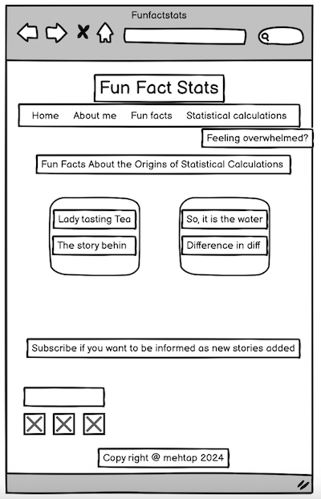
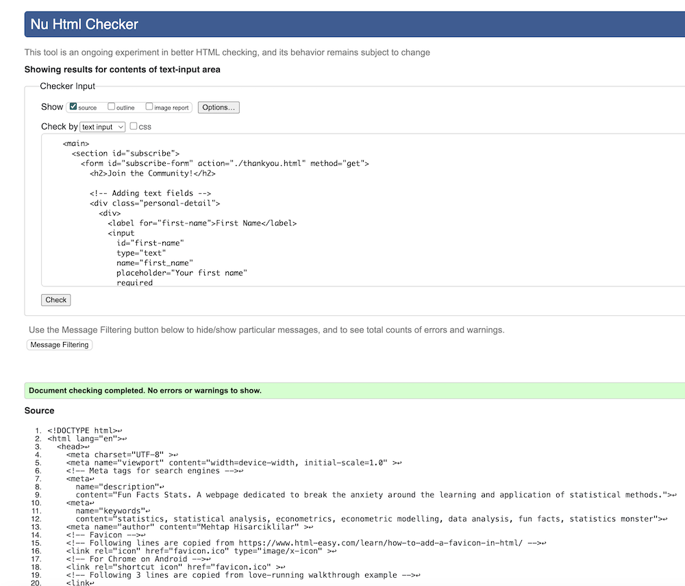

# Fun Facts Stats

Fun Fact Stats is a webpage dedicated to break the anxiety around  the learning and application of statistical methods.
Students tend to struggle with statistical concepts. They have pre-set opinions about Statistics, which make them anxious even before starting to learn. Also, in most cases, they perceive statistics to have abstract concepts; it is very hard for them to relate and to see the point of all calculations. 

This website aims to show the learners and users of statistical methods the fun side of statistics. It will achieve this through two means: 

1. Providing fun facts about statistics

  This first item is the focus of this project. 
  
2. Designing online games starting from the very basic and advancing further as understanding improves.

  Although this is integrated into the design, and a placeholder navigation item and a page is included, this will not be included in the checks provided below. 
  
The inspiration for this page came from the book "Lady Testing Tea: How Statistics Revolutionized Science in the Twentieth Century" by David Salsburg. Hence, the first fun fact on the site is Lady Testing Tea. The aim is to add new stories, new fun facts regularly to keep the users of the website engaged. 

## User Experience

The target audience for this website are UG students, although anybody who is interested with statistics is welcomed!

### User Stories

Users of the website expect the following: 

- Be familiar with the page design in term of the placement of the navigation bar items, the social media links, etc. 
- Navigate around the site easily without frustration.
- Easily read and understand  the information provided in the pages. 
- Can see clearly which statistical concept the fun fact story relates to.
  
### Site Owner's Goals

I aim to break the anxiety around learning statistics by 

- creating a warm, welcoming page 
- providing users with examples and stories that they can relate to 
- creating a positive environment around the use of statistics
- creating a statistics game to help users learn new concepts they as progress (please note this is a plan for a longer time period; it is not covered within this project)

## Design

### Color Scheme

Colors with the following hex values are used in this website:

- #ffd700 (named color: gold)
- #2e8b57 (named color: seagreen)
- #3a3a3a;
- #808080 (name color: gray)

The tone for the seagreen had to be changed in some parts to a slightly darker version to ensure sufficient contrast. 

A darker tone of gray had to be used in fun facts pages, again, to ensure sufficient contrast. 

Please see below for color change details. 

### Fonts

The following fonts are used:  

- "Lexend" for the body and footer text. "Lexend" is chosen for the main text because a small scale study has shown that people can read and understand more easily when this font style is used. I have been using this font in documents that I produce for my students (in my professional role). 

- "Happy Monkey" for headings level 2 and higher. I found this font after a search on keywords "smile", "fun", and "happy" on Google Fonts. Since the page is aiming to the "fun", a font style that would give that effect was preferred. Like "Lexend", "Happy Monkey" is also easy to read, and it is  "fun". It also matches the font style I use for the header ("Rock Salt") 

- "Rock Salt" for heading level 1 (which is the main header of the wage). Choosing the font style for header was the most difficult. Since it serves as the logo to the page, it takes an important role.

- "Jost" for motivational poster page

#### Fonts for the Header

I tried alternative fonts for the header. Because the page targets students and aims to help them feel more comfortable with statistics, I wanted the header to be fun and dynamic. 

Below, I provide screenshots of some alternatives considered. 

The last screenshot above is the font chosen for the header.

### Wireframes

- I mostly worked on paper-based wireframes as it was easier to draw quickly. 
- 
- I used Balsamiq to create the following wireframe. This respresents the initial idea of having a fun facts page with a multiple list of fun fact stories (also explained in the features section below), later to be directed to a more detailed page about a single story on click. 
   

## Features 

### Existing Features

#### Favicon

- The normal distribution is chosen as the favicon for this website due to its simplicity, allowing for an easy recognition even when it is tiny. 

- The area under the normal distribution curve is shaded in red to introduce a greater contrast with the white background and also it is the same color as the "anxious" statistics monster.

#### Navigation Bar

- The navigation bar includes links to five main pages: Home, Fun Facts, Fun Stats, Subscribe, Feeling overwhelmed? 

- The background color of the navigation bar is chosen to be a warm color, gold, to create a positive feeling for the user.

- Similarly, the header fonts (Rock-Salt and Happy Monkey) are  chosen because of their fun-looking style, to match the title. 

- The navigation links open on the same page, except "Feeling overwhelmed?", which opens on a new page. This is because the latter is designed to be an impactful motivational poster, free of any header or footer items. 

#### Landing page

- Landing page includes images of two cute fluffy monsters. 
  - The grumpy-looking red monster (anxious monster) represents the anxiety around statistics and how people perceive it to be scary. Although it is perceived to be scary, it actually is not. 
  - The fluffy blue monster with a smiling face (happy monster) is the real identity of statistics: fun, playful, and engaging

- I wanted the user to see the "real" face of the statistics monster by somehow changing the look of the anxious monster to a happy monster. With the limitations of the html and css, I did this using hoover style. In large screens, hoovering over the anxious monster reveals the real face of it: the happy monster.   

Image on site as it appears

Image response to hovering

- Inspired by the Code Institute's love-running walk through example, these images are included as background images. Because each of these images also represent a meaning, an alt text for each was added through using hidden images in the div they are located. 

- Through the happy monster, statistics is depected as fun, engaging, playful, and also helping the user to get stronger (i.e. more employable). Each of these characteristics are linked to a page:
  - _fun_ links to "fun facts" page
  - _engaging_ links to "subscribe" page (note: this is not a perfect match, and will need to be revisited in the future)
  - _playful_ links to "fun stats" page
  - makes you _stronger_ links to "motivational" page.

- The color of text linked to these pages changes to pink when user hovers on large screens 

#### Fun facts page

- This page aims to show learners of statistics some interesting facts about statistics by revealing where (or under which circumstances) the most commonly used statistical concepts originate from. 

- At the moment, there is a single story under this page. The intention is  to develop it further, adding more interesting facts over time. In that case, the "fun facts" page will have a list of fun fact stories and links to corresponding pages while each fun-fact story will be provided on a different page. 

- Considering the structure described above, the top of the page starts with an informative path to the page (please note that at the moment "fun facts" page is the same as the "lady tasting tea" page, but this will change as more stories are added.)

- Below the path, there is a set of keywords that the fun fact story covers. This will help the users to relate the story with the statistical concepts. These can later be used to introduce a search feature on the site.

#### Fun stats page

- There is a placeholder for this page on the website but currently the only content is an under-construction-type image. 

- To encourage users to come back to the page, brief information is provided with text "stats game under construction" rather than a general message (which may become very discouraging). 

- It will be an interactive page which aids students in their learning by starting from the basic calculations and moving on to more complicated ones as students progress. 

- It will achieve the above objective by creation of a simple interactive statistics game.

#### Motivational poster page

- This is a poster that I created while learning CSS formatting and the Box Model.  

- It is a page on its own right. Therefore it is the only link on the navigation panel that opens on a new page. It does not have a link back to the homepage either. It is self-standing.  

- It shows quite a contrast to other pages on the site, but it is designed to impress and take the whole attention to the message. 

- It is a reminder for everybody: learners of all subjects, people working towards their targets, and myself. 

- I used two alternative, but similar images for this page. An image in portrait view loads for mobile phone users while another image with a landscape view loads for tablets and gadgets with larger screens.  

### Features to be Added

- The Fun Stats pages which provides an interactive learning environment 

- Addition of more fun fact stories 
  - The next story will be on the t-distribution and how statisticians of the Guinness beer factory came with the idea.

- Addition of a search button for users to search for relevant concepts

- Adding labels to all form elements to ensure full accessibility (at the moment, there are some accessibility issues related to that). 

- Removing the Wikipedia iframe and inserting a more direct search field in the text because reading is not very easy within the iframe, in particular on smaller screens. 

## Testing 

### Validation of Code

For HTML files, I used the [W3C HTML Validator](https://validator.w3.org/#validate_by_input) and for the CSS file, I used  [W3C CSS Validator](https://jigsaw.w3.org/css-validator/).

- All three html pages (landing page, fun facts page, subscribe page) are without errors

- The css file is without error. There is one warning about the "Jost" Google font import.

#### Landing Page

    
#### Fun Facts page

#### Subscribe page

    
#### CSS code
  

  

    
    
### Lighthouse

#### Landing Page

My index page had an accessibility score of 85%. I followed the steps below to increase it to 100%: 

- I changed the seagreen color that I used for linked text under the happy monster image into #20643F, which provides a better contrast with the white background. 
- I increased the font size for the above-mentioned links
- I changed the color of the text at the very bottom of the footer to a darker color (#154229)
- I added aria-label link text to the links below the happy monster mentioned above
- I added aria-label link text to the links in the navigation bar items 

    

#### Fun Facts Page

The initial accessibility score was 90%. I followed the steps below to increase it to 100%:

- The path to the page I provided at the top of the fun facts page was in color #807575. This did not provide enough contract. I changed it to #554E4E. 

- I added a title to the Wikipedia iframe.

  

- __Just before submission__, I saw on the checklist for submission a video or an audio embed as one of the requirements. The accessibility score did not change after adding the video frame, but it lowered down the "best practices" score due to high amount of cookies. Below is a screenshot

  

#### Subscribe Page

The initial accessibility score was 86%. I followed the steps below to increase it to 91%:

- To obtain sufficient contrast, I changed seagreen color on the submit and reset buttons to #21643E
- I added aria-label and aria-labelby texts to form elements, but I there are still a couple of labels to be added. I will need to read about how to do those before I could make a change. 

  
  

### Manual Testing

I checked the responsiveness and overall look of the pages in multiple gadgets, using different operating systems manually. I also used Google Developer Tools intensively. 

#### Navigation Bar 

| Feature being tested | Expected Outcome | Testing Performed | Actual Outcome | Result (Pass or fail) |
| -------------------- | ---------------- | ----------------- | -------------- | --------------------- |
| Nav bar item links   | Loads corresponding page | Multiple screen sizes & operating systems | Corresponding page loads | Pass |
| Responsiveness of the nav bar  | Nav bar opens as drop down after clicking on toggle in phones | Mobile phones, iOS and Android  | Nav bar opens as drop down after clicking on toggle in phones | Pass |
| Active page marked on nav bar | Active page marked with shadow on large screens| Tablets, laptops and desktops; different operating systems | Active page is marked with a visible shadow on nav bar | Pass |
| Highlighted nav bar items on hover on large screens| Nav bar items respond when user hovers over text  | Laptops and desktops; different operating systems | Nav bar items change color when user hovers over them | Pass |

#### Footer 

| Feature being tested | Expected Outcome | Testing Performed | Actual Outcome | Result (Pass or fail) |
| -------------------- | ---------------- | ----------------- | -------------- | --------------------- |
| Responsiveness of social media links  | Social media links spread over the line on mobile and tablet screens; remain on left of the page on larger screens with sufficient gap between them | Multiple screen sizes and operating systems | Social media links spread over the line on mobile and tablet screens; remain on left of the page on larger screens with sufficient gap between them | Pass |
| Responsiveness of informatory text on bottom right  | Each item of the informatory text at the bottom right is on a separate line on mobile screens (4 separate lines); two lines merge under two separate lines on tablets and larger screens; all aligned right with some small margins| Multiple screen sizes and operating systems  | Each item of the informatory text at the bottom right is on a separate line on mobile screens (4 separate lines); two lines merge under two separate lines on tablets and larger screens; all aligned right with some small margins | Pass |

#### Body of the Landing Page
| Feature being tested | Expected Outcome | Testing Performed | Actual Outcome | Result (Pass or fail) |
| -------------------- | ---------------- | ----------------- | -------------- | --------------------- |
| Responsiveness of text and images  | On mobile  screens, images of two monsters appear vertically aligned while text is spread over, in between and below images; on tablet and larger screens, anxious monster is on the left of the screen while happy monster is on the right, each have corresponding text next to them | Multiple screen sizes & operating systems | On mobile  screens, images of two monsters appear vertically aligned while text is spread over, in between and below images; on tablet and larger screens, anxious monster is on the left of the screen while happy monster is on the right, each have corresponding text next to them| Pass |
| Anxious monster respond on hover | Anxious monster turns into a happy monster on hover on laptops or larger screens | Laptops and desktops, different operating systems  | Anxious monster turns into a happy monster on hover on laptops or larger screens | Pass |
| Links to website pages through text on the left of happy monster | Corresponding website pages load after a click or a touch on the following words: fun, engaging, playful, stronger | Mobiles, tablets, laptops and desktops| The link on "fun" loads "fun facts" page; "engaging" loads "subscribe" page; "playful" loads "fun stats" page; "stronger" opens a motivational poster on a new page; all of these happen after a touch on mobiles and tablets, and after a click on laptop and desktops  | Pass |
| Response of links on hover  | On laptops and desktops, the linked words described above respond to hover  by changing color | Laptops and Desktops; different operating systems  | On laptops and desktops, the linked words described above respond to hover  by changing color to pink | Pass |

#### Body of the Fun Facts Page

| Feature being tested | Expected Outcome | Testing Performed | Actual Outcome | Result (Pass or fail) |
| -------------------- | ---------------- | ----------------- | -------------- | --------------------- |
| Responsiveness of the text and the iframe | Text enlarge or contract without any formatting issues depending on the screen size   | Multiple screen sizes and operating systems | Text contract on mobiles and tablets and expand on laptops and desktops without creating a messy layout. All text can be read easily in all screen sizes.   | Pass |
| Links to external pages | Links to external pages open on a new page | Multiple screen sizes and operating systems | Links to external pages open on a new page | Pass |
| Functioning YouTube iframe | YouTube video plays on demand | Multiple screen sizes and operating systems  | YouTube video plays on demand  | Pass |
| Functioning wikipedia iframe | The search field of Wikipedia page works on the iframe | Multiple screen sizes and operating systems  | One can enter search phrases and get results in the Wikipedia iframe | Pass |

#### Form on the Subscribe Page
| Feature being tested | Expected Outcome | Testing Performed | Actual Outcome | Result (Pass or fail) |
| -------------------- | ---------------- | ----------------- | -------------- | --------------------- |
| Form responses recorded | Users are directed to a thank you page on completion of the form | Multiple screen sizes and operating systems | Users are directed to a thank you page within the site (otherwise hidden from users) once they complete the required fields on the form | Pass |
| Form warning the users when details are missing | Form not submitting and providing a helpful text for readers when they skip the required fields | Multiple screen sizes and operating systems | Form does not submit and shows a message when (i) name or surname are missing (ii) email text does not include an @ sign, (iii) age is not selected, or (iv) contact permission is left without a response | Pass |
| Functioning subscribe button  | Pressing the subscribe button submits the completed form   | Multiple screen sizes and operating systems  | Pressing the subscribe button submits the completed form and takes the user to a thank you page | Pass |
| Functioning reset button  | Pressing the reset button clears the form without submitting information  | Multiple screen sizes and operating systems  | Pressing the reset button clears the form without submitting information | Pass |

## Credits

### Favicon

- Favicon is created from a png file using  [https://favicon.io/](https://favicon.io/). The picture file used is created by me on my tablet. 
  
-  The code on the head of the html files to insert favicon are copied from two sources: 
  - Love running walkthrough example
  - [How to Add a Favicon in HTML: Your Easy Step-by-Step Guide](https://www.html-easy.com/learn/how-to-add-a-favicon-in-html/) by Cristian G. Guasch. [Accessed 13 September 2024]  
  

### Fonts

- Text-based fonts used in this project are downloaded from [Google Fonts](http://fonts.google.com). 

- The social media and other symbols used on pages are from [Font Awesome](https://fontawesome.com/).
   
### Images

- Monster images are obtained from [iStock](https://www.istockphoto.com) 

- [tinyjpg](https://tinyjpg.com) platform is used for compressing images for uploads
  
- My mentor Matt Bodden's advice over resizing photos resolved issues for the design 

### Hidden images

- The idea of using hidden images to be able to use alt text is taken from Oliver Hall's explanation on Content Forest: [Question: How to add alt text for a background image in HTML/CSS?](https://contentforest.com/faq/how-to-add-alt-text-for-background-image). I used the example code provided there. [Accessed on 12 September 2024]

### Image swapping 

- The idea of image swapping with a media query is taken from [jmore009's post on stack overflow](https://stackoverflow.com/questions/27853884/media-queries-and-image-swapping) [Accessed on 12 September 2024]. 

### Coding-related

-  I used [GitHub Guides](https://github.com/git-guides) to read about GitHub terminal commands I needed during my work on the project:
  
- I used the following pages to help me understand the source of issues that I encountered and how to fix them: 
  - [GitHub Guides](https://github.com/git-guides)
  - [Stack overflow](https://stackoverflow.com)
      - To solve the issue of a connection failure, Pawel Trojanski suggested to increase buffer size by using `git config http.postBuffer 524288000`. Available from [https://stackoverflow.com/questions/77856025/git-error-rpc-failed-http-400-curl-22-the-requested-url-returned-error-400-se](https://stackoverflow.com/questions/77856025/git-error-rpc-failed-http-400-curl-22-the-requested-url-returned-error-400-se) [Accessed 13 September 2024]
- The YouTube video refused to play when I included the video url on fun facts page. I resolved the issue by  making a change in the video address following the suggestion of [camperbot](https://forum.freecodecamp.org/t/youtube-refused-to-connect/245262) on [freeCodeCamp](https://forum.freecodecamp.org/) [Accessed on 15 September 2024].
### Font Color

- I used the [Color Contrast Analyzer](https://dequeuniversity.com/rules/axe/4.9/color-contrast) to find the right replacement for the colors that failed the contrast test during Lighthouse checks. 

### Form

- The examples provided in the love-running walkthrough example and the Coders Coffeehouse pages were very helpful. I changed these and applied my own coding, but I learned a lot from these examples during the process. 

- The checkbox margins are set using the post by [Suraj Parise's post on stack overflow](https://stackoverflow.com/questions/54003551/how-to-do-the-spacing-between-checkboxes-and-values) [Accessed on 14 September 2024].

- I read about the HTML select form attribute on [W3 Schools](https://www.w3schools.com/tags/att_select_form.asp) [Accessed on 14 September 2024]
  
- I got the idea of directing the form response to a "thank you for subscribing"" page from my mentor, Matt Bodden.

### Code formatting

- I used VS Code's "Prettier Code Formatting" extension to finalise the formatting of the html code.
- I used VS Code's "Beautify" css formatting extension to finalise the formatting of the css code. 

## Acknowledgements

I extend my thanks to my mentor Matt Bodden, for the information and guidance that he provided during our mentoring sessions. My conversations with him helped to shape this website and more importantly, to resolve some issues that I faced while working on the project. 

I thank my partner Robert Riegler who kept testing the pages as I worked on them using his own gadgets. This allowed me to perform the tests on different brands of electronic gadgets and different operating systems.  
  

